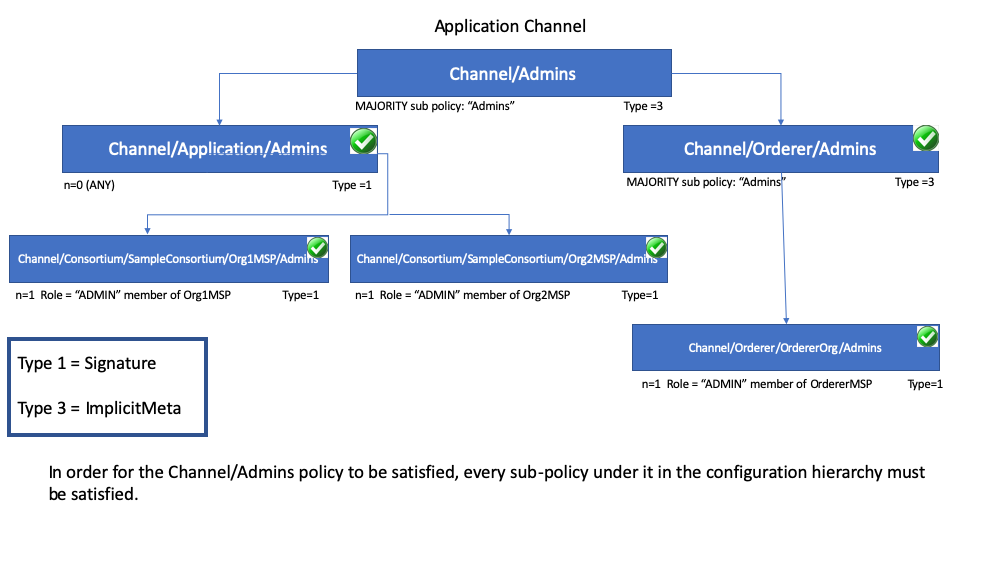

# 제목 없음

2024/07/07

### Policies 정의

멤버들이 다음의 변경 사항을 승인/거부하는 합의 방식

- 적용 가능 대상
    - 채널 구성 변경
        - 채널 생성, 수정
    - 스마트 컨트랙트 관리
        - 컨트랙트 설치, 인스턴스화, 승인
    - 트랜잭션 승인
        - 트랜잭션 제출, 검증
    - 데이터 접근
        - 체인 데이터, 상태  데이터 읽기/쓰기
    - 네트워크 구성 요소  관리
        - orderer, peer
- 정책이 보여줄 수 있는 것
    - 채널에서 멤버 추가/삭제
    - 블록 형성 방식 변경
    - 스마트 계약 보증에 필요한 조직의 수

### 어떻게 작성하는가?

- Fabric에서 특정 리소스를 수정하고 싶으면 연관 policy에 명시된 누군가에게 승인받아야 한다.
    - 예시
        - explicit sign off: policy에 명시된 그룹의 특정 누군가
        - implicit sign off: policy에 명시된 그룹의 과반수 이상
- explicit sign off → `Signature syntax`
- implicit sign off → `ImplicitMeta syntax`

### Signature Policies

- 조직 내 특정 역할을 가진 멤버들의 서명으로 정책이 충족되는 방식
- 각 서명 정책은 최소 서명자 수와 서명자 역할을 명시
- 조직의 관리자가 서명함으로써 특정 행위를 승인 가능
- ex. `OR('Org1.peer', 'Org2.peer')`, `NOutOf(2, 'Org1.admin', 'Org2.admin', 'Org3.admin')`
- `AND, OR, NOutOf`  등 다양한 연산자 지원
    
    

### ImplicitMeta Policies

- 하위 정책의 결과가 상위 정책의 결과를 결정



- SubPolicy: `MAJORITY, ALL, ANY`
    - MAJORITY: 하위 정책 중 과반수 이상이 충족되어야 상위 정책이 충족
    - ALL
    - ANY: 최소 1개만 충족되면 상위 정책 충족
- n: 최소 서명 수
- 장점
    - 새로운 Org가 채널에 추가될 때, 정책을 일일히 다시 업데이트하지 않아도 됨
        - 새로운 org의 admin이 자동으로 포함

### 예시

[https://github.com/hyperledger/fabric-samples/blob/main/test-network/configtx/configtx.yaml](https://github.com/hyperledger/fabric-samples/blob/main/test-network/configtx/configtx.yaml)

```java
Organizations:
  - &OrdererOrg
    Name: OrdererOrg
    ID: OrdererMSP
    MSPDir: ../organizations/ordererOrganizations/example.com/msp
    Policies:
      Readers:
        Type: Signature
        Rule: "OR('OrdererMSP.member')"
      Writers:
        Type: Signature
        Rule: "OR('OrdererMSP.member')"
      Admins:
        Type: Signature
        Rule: "OR('OrdererMSP.admin')"
    OrdererEndpoints:
      - orderer.example.com:7050
```

- **Readers**:
    - **적용 리소스**: OrdererOrg 구성원들이 블록체인 데이터 및 상태 데이터를 읽을 수 있는 권한
- **Writers**:
    - **적용 리소스**: OrdererOrg 구성원들이 데이터를 쓸 수 있는 권한
- **Admins**:
    - **적용 리소스**: OrdererOrg 구성원들이 채널 구성 변경 등 관리자 권한을 행사할 수 있는 권한
    
    ```java
      - &Org1
        Name: Org1MSP
        ID: Org1MSP
        MSPDir: ../organizations/peerOrganizations/org1.example.com/msp
        Policies:
          Readers:
            Type: Signature
            Rule: "OR('Org1MSP.admin', 'Org1MSP.peer', 'Org1MSP.client')"
          Writers:
            Type: Signature
            Rule: "OR('Org1MSP.admin', 'Org1MSP.client')"
          Admins:
            Type: Signature
            Rule: "OR('Org1MSP.admin')"
          Endorsement:
            Type: Signature
            Rule: "OR('Org1MSP.peer')"
    ```
    
    - **Endorsement**:
        - **적용 리소스**: Org1MSP의 피어들이 트랜잭션을 승인할 수 있는 권한.
        
        ```java
        Application: &ApplicationDefaults
        
            # Organizations is the list of orgs which are defined as participants on
            # the application side of the network
            Organizations:
        
            # Policies defines the set of policies at this level of the config tree
            # For Application policies, their canonical path is
            #   /Channel/Application/<PolicyName>
            Policies:
                Readers:
                    Type: ImplicitMeta
                    Rule: "ANY Readers"
                Writers:
                    Type: ImplicitMeta
                    Rule: "ANY Writers"
                Admins:
                    Type: ImplicitMeta
                    Rule: "MAJORITY Admins"
                LifecycleEndorsement:
                    Type: ImplicitMeta
                    Rule: "MAJORITY Endorsement"
                Endorsement:
                    Type: ImplicitMeta
                    Rule: "MAJORITY Endorsement"
        
        ```
        
        **LifecycleEndorsement**:
        
        - 체인코드 라이프사이클(설치, 정의 등)에 대한 승인 정책을 정의

### Chaincode Endorsement Policy

- 체인코드 관련 모든 상태에 적용되는 정책
- 트랜잭션 승인 위해 필요한 피어 및 검증 요구사항 정의
- 지정 방법
    - channel config 파일 참조
    - 명시적 signature 정책 지정
- Default policy
    - `MAJORITY Endorsement`
    - 채널의 각 조직 피어 중 과반수 이상이 TX 실행, 검증에 참여해야 한다.

### 다음주 할 일

- **Create Basic Network using Hyperledger Fabric 2.0**
    - 8강까지 해오기~!
    - 핵심 내용 요약 정리
    - 여건되면 심화 내용 세미나까지 준비!