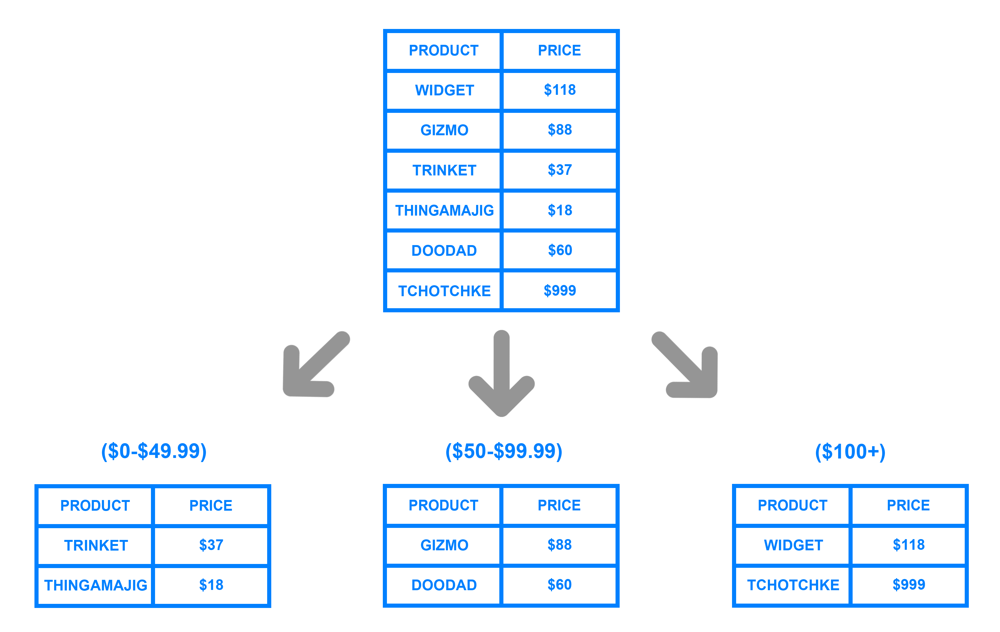
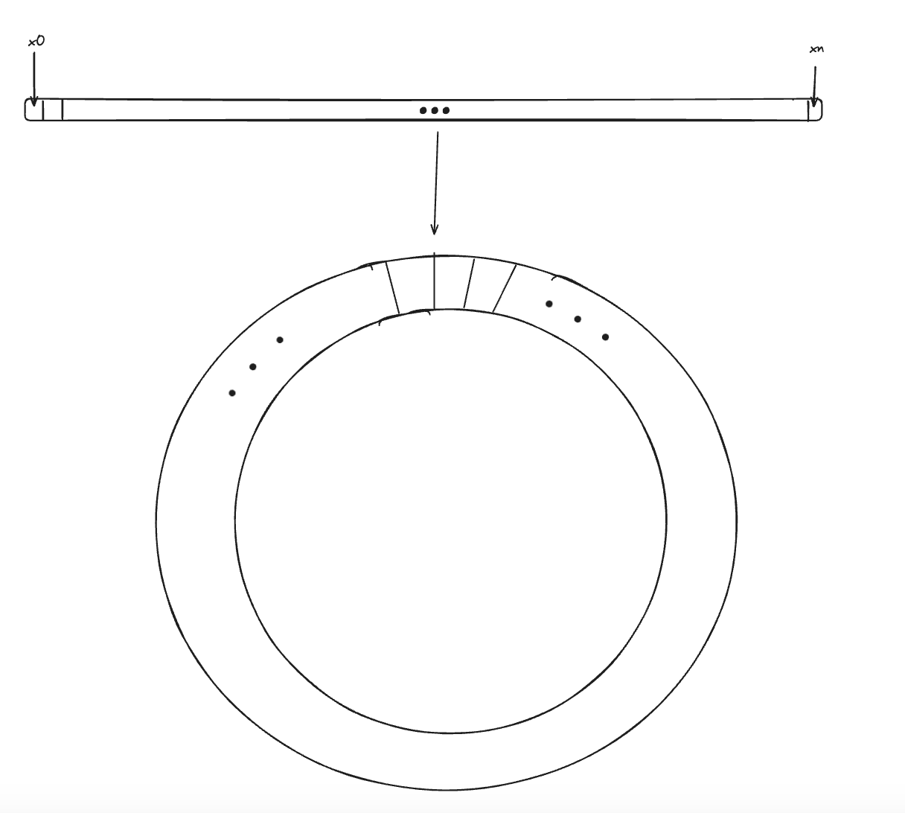

# 20240714 스터디

## 1-8장

- 세팅 내용이라 말할 게 없었다.

서버 ← 단일 서버는 대규모 시스템에서 확장 필요

해결책

- 스케일업 (SPOF)
- **스케일아웃 (비슷한 성능의 DB를 여러 개 분산시키는 개념)**
  - 데이터 엄청 많으면
  - 서버를 분할해도 각 DB가 같은 대규모 데이터를 들고 있으면 또 부하…

### 샤딩

- 데이터를 작은 단위인 샤드로 저장하고 관리하는 기법

### 샤딩 시 발생하는 문제

- 데이터 불균형
  - hotkey problem
  - celebrity problem
  - autoscaling

### 해시 키 재배치 (rehash) 문제

- N개의 캐시 서버가 존재한다 가정
- 서버 간 부하를 균등하게 나누는 보편적 해시 함수

  - `serverIndex = hash(key) % N` (N은 서버 개수)

- server pool이 크기가 고정되어 있거나, 데이터 분포가 균등할 때는 OK
- 오토스케일링을 적용하는 상황이나, 장애 상황에서 대규모 캐시 미스가 발생함

### consistent hash는 이러한 문제를 해결함

### Consistent Hash

- 해시 테이블의 크기가 조정될 때, 평균적으로 오직 k/n개 키만 재배치하는 해시 기술
- k=키의 개수, n=slot의 개수
- 대부분의 전통적 해시 테이블은 슬롯 수가 바뀌면 키를 재배치함

- 동작 원리

  - 해시 함수 f는 SHA-1을 사용한다 가정
    - SHA-1의 해시 공간 범위 0~2^160-1
  - f의 출력 값 범위 x0,x1, …, xn
  - 해시 공간의 양쪽을 구부려 접으면 해시 링 생성

- 해시 함수 f를 통해 서버 IP나 이름을 해시 링의 특정 위치에 대응시킬 수 있다.

- s0, s1… : 서버
- k1, k2… : 키
- 해시 함수 f는 모듈로 연산을 사용하지 않는다.

  - ⇒ sn과 kn이 중복 위치에 배치되지 않는다는 것

- 서버 조회

- 키가 저장될 서버를 탐색하는 법

  - 시계 방향으로 링을 탐색하며 만나는 첫번째 서버

- 서버 추가

- 서버를 추가하더라도 k0만 재배치된다.

- 서버 제거

- s1 서버가 제거되더라도 k1만 s2로 재배치된다.

### 기본 구현법의 2가지 문제

안정 해시 알고리즘은 다음 절차를 갖는다.

- 서버와 키를 균등 분포 (uniform distribution) 해시 함수를 사용해 해시 링에 배치
- 키의 위치에서 링을 시계 방향으로 탐색하여 저장될 서버 결정

### 서버가 추가되거나 삭제되는 상황에서 파티션의 크기의 균등함을 유지 불가

- 파티션: 인접 서버 사이의 해시 공간
  - 어떤 서버는 큰 파티션을, 어떤 서버는 작은 파티션을 할당 받을 수 있음
  - 서버가 추가되거나 삭제되면 불균등 심화

### 키의 균등 분포 문제

- 많은 키가 특정 서버에 보관될 수 있다

### 해결책: 가상 노드

- 하나의 서버가 링 위에 여러 개의 가상 노드를 가질 수 있다.
- 서버 s0은 가상 노드 s0_0, s0_1, s0_2를 갖는다.
- 각 서버는 이제 여러 개의 파티션을 관리해야 함

- 가상 노드의 개수를 늘릴수록 키 분포가 더 균등해짐
  - 노드 데이터를 저장할 공간은 더 많이 필요해짐 (tradeoff)

### 재배치할 키 결정

- 서버가 추가되거나 제거될 때 모든 키의 재배치 여부를 탐색할 필요는 없음
- 영향 받은 범위는 수정이 발생한 노드부터 그 반시계 방향에 있는 최근접 서버 사이

### 안정 해시의 이점

- 서버 추가 및 삭제 시 재배치되는 키의 수 최소화
- 데이터의 균등 분포 달성 ⇒ 수평적 규모 확장성 달성 가능
- 샤딩 시 발생하는 hotspot key 문제 경감

### 안정 해시를 적용한 사례

- DynamoDB 파티셔닝 컴포넌트
- Cassandra 클러스터의 데이터 파티셔닝
- Discord
- Akamai CDN
- Meglev NETWORK LB

### 다음주 할 일

- 15강까지 듣고 정리하기
- 심화 세미나
  - Raft 알고리즘 (분산 합의)
