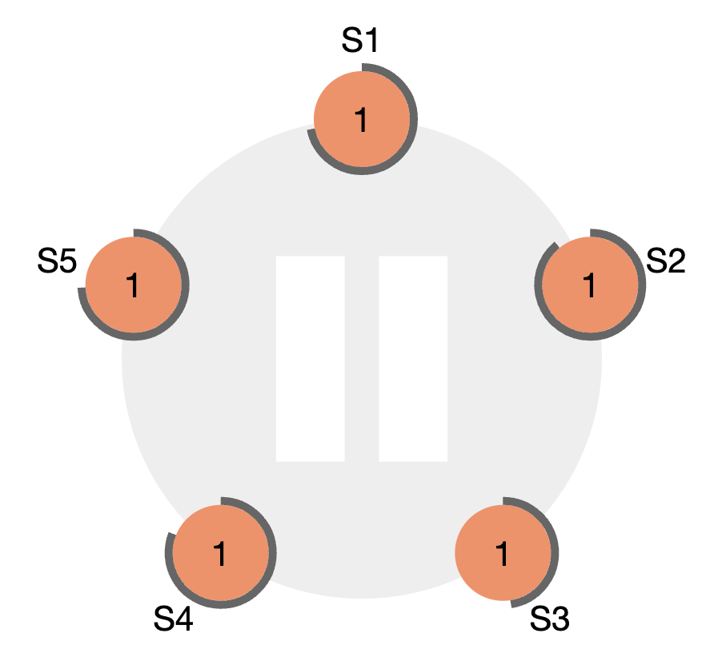

# Raft Algorithm

## Background

### Consensus

- 분산 시스템에서 노드 간의 상태를 공유하는 알고리즘
- 블록체인의 consensus 알고리즘과는 다른 개념

|  | Raft consensus | BlockChain consensus |
| --- | --- | --- |
| 설계 목표 | 분산 시스템에서의 일관성과 가용성 보장 | 중앙화된 권한 없이 거래의 무결성 보장 |
| 신뢰 모델 | 노드들은 서로 신뢰 가능, 악의적인 노드 없음. | 노드 간 신뢰 불가능, 악의적인 노드 존재한다고 가정 |
| 합의 과정 | Leader Election | PoW, PoS 등 다양한 메커니즘 사용 |
| 확장성 | 소규모 클러스터 | 대규모 네트워크 |
| 데이터 관리 | 로그 복제, 커밋 메커니즘 | 분산 원장 (모든 노드가 동일한 복사본 유지) |

### Consensus Problem

- 어떤 자료 값에 대해 여러 프로세스들이 값을 하나로 결정해야 한다.
- 몇몇 프로세스는 고장나거나 모종의 이유로 믿을 수 없음
- ⇒ 합의 프로토콜은 장애 허용이거나, 복원력이 있어야 한다.
    - `Fault Tolerance`
        - 시스템의 일부 구성요소에 장애가 생겨도 전체 시스템의 기능은 유지된다.
    - `Resilience`
        - 시스템에 장애가 발생해도 다시 정상 운영 상태로 빠르게 복구될 수 있다.
- Fault tolerance한 합의 프로토콜은 다음의 3가지 속성을 지닌다.
    - `Termination`
        - 결과적으로 모든 정상 프로세스는 어떤 값을 정한다.
    - `Integrity`
        - 모든 정상 프로세스들이 같은 값 v를 제안했다면, 정상 프로세스들은 반드시 값을 v로 정해야 한다.
        - Integrity는 적절하게 변형될 수 있다.
            - 일부 정상 프로세스가 제안했던 값으로 합의되는 더 약한 수준의 무결성은 `Validity`로 알려져 있다.
    - `Agreement`
        - 모든 정상 프로세스는 반드시 값이 일치한다.

### Replicated State Machine (복제 상태 머신)

- 여러 복제본들이 동일 순서로 동일 명령을 실행하여, 동일 상태를 유지하는 시스템
- **합의 알고리즘은 RSM을 구현하기 위해 사용하는 수단이다.**
- 블록체인 역시 복제 상태 머신의 한 종류라 할 수 있음
    - 각 노드가 동일 상태를 유지하는 것을 목표로 하기 때문
- Raft에서는 Replicated Log를 구성하여 복제 상태 머신을 구현
    - Replicated Log
        - 클러스터에 연결된 모든 노드에 대해 사용자 명령어를 동일 순서로 저장
        - 일관된 로그를 잘 복제하면, 클러스터의 각 노드의 상태 머신이 명령어를 순차 해석 → 동일 상태로 만듬
        - 메시지는 결정론적 명령만을 수행 → 항상 동일 상태 보장
        - 클라이언트는 `consensus module`에 로그 기록 요청 → 다른 서버에 전달 → 서로 다른 노드에 저장된 `replicated log`가 `eventual consistency`임을 보장
- 복제 상태 머신은 다음의 속성을 만족함
    - Stability
        - non-Byzantine 조건에서 안정성을 갖춰야 한다.
        - e.g. 네트워크 지연, 네트워크 파티션, 패킷 손실, 중복 전송
    - Availability
        - 다수 서버가 동작하고 서로 통신 가능하다면, 모든 기능은 정상 동작해야 한다.
        - e.g. 5개 클러스터로 구성된 시스템은 최대 2개의 장애 허용성을 가진다. (=최대 2개의 노드가 실패해도 정상 작동 보장)
    - Time Independence
        - 로그의 일관성을 유지하기 위해 타이밍에 의존해서는 안 된다.
        - 고장난 시계, 급격한 메시지 지연에 의해 가용성이 영향 받으면 X
            - Faulty Clock
                - 분산 시스템에서 각 노드의 로컬 시계가 완전히 일치하지 않을 수 있다.
                - 시스템의 합의 과정에서 Timestamp를 사용해서는 안 된다.
                - 해결법
                    - 타임스탬프 대신 논리적 이벤트 순서, 메시지 전달 순서에 기반
                    - Lamport Timestamps, Vector Clock과 같은 논리적 시계로 이벤트 순서 결정
            - Sudden Message Delays
                - 메시지 지연이 심할 경우, 일부 노드가 메시지를 제때 받지 못해 합의 과정에 영향을 끼칠 수 있다.
                - 해결법
                    - Timeout
                    - Retry
                    - Duplicated Message Handling
                    - Async
    - Fast Success with Majority Responses
        - 다수의 클러스터가 하나의 라운드에서 응답했다면, 시스템은 바로 성공할 수 있어야 한다.
        - 하나의 느린 서버가 시스템 전체 성능에 영향을 주면 X

## Raft Algorithm

### Raft의 등장

- non-Byzantine 환경의 합의 알고리즘
- 2014년 USENIX에서 발표된 *“In Search of an Understandable Consensus Algorithm”*
    - Understandable한 합의 알고리즘을 만드는 데 목적이 있었다.
    - Raft 이전에 쓰이던 Paxos는 이해가 매우 어려웠다고 함

### Div & Conquer

- Raft는 합의 알고리즘을 크게 3가지 문제로 분할해 해결한다.
    - Leader Election
    - Log Replication
    - Safety
- 이 3가지 문제에 대한 해결법을 하나의 consensus module로 만듬

### Three States of Raft Node

- 모든 노드는 3가지 중 하나의 상태를 가진다.
    - Leader
        - 클러스터를 대표하는 단일 노드
        - client가 클러스터로 보낸 모든 명령의 수신, 전파, 응답을 전담
        - 자신의 heartbeat를 주기적으로 모든 팔로워에게 전파
    - Follower
        - 리더가 아닌 모든 노드의 상태
        - 리더로부터 전파된 명령을 처리하는 역할만 담당
    - Candidate
        - 리더가 없거나, 무응답 상태일 경우 일시적으로 존재하는 상태
        - 새 리더를 정하기 위해 전환된 follower의 상태
        - 리더로부터 일정 시간 이상 heartbeat를 받지 못한 팔로워는 candidate로 전환됨

### Leader Election

- Background
    - 노드는 한 순간에 하나의 상태만 가진다.
    - 노드는 Term (임기) 제도를 통해 리더를 선출한다.
        - Term은 1씩 증가하는 값이다.
        - 매 임기마다 리더를 선출한다.
    - `Election Timeout`
        - 팔로워 노드가 후보자로 변환되기까지의 대기시간
        - 모든 팔로워 및 후보자 노드에게 150~300ms 사이의 각기 다른 임의의 값으로 주어진다.
    - `Quorum` (정족수)
        - 분산 시스템의 결정이나 변경에 필요한 최소한의 동의 수
        - `(N+1)/2` 와 같거나 큰 자연수
        - 장애 노드가 전체 노드의 `(N-1)/2`개 이하라면, Fault Tolerance가 유지됨을 보장한다.
    - Optimal Number of Node for Fault Tolerance
        - 합의 알고리즘을 채택한 분산 시스템은 전체 노드의 개수를 3개 이상의 홀수로 유지하는 것을 권장한다.
            - 최소 3개의 노드가 있어야 클러스터의 fault tolerance가 보장된다.
            - 홀수 노드여야 허용 가능한 장애 노드 수의 비율이 더 높다.
- Process
    1. 리더가 없는 상황에서, 모든 노드는 팔로워 상태를 유지함
    
    
    
    - 각자 주어진 election timeout까지 대기
    1. Election Timeout이 가장 먼저 끝난 노드는 후보자로 전환
        - 새로운 Term의 시작
        - 후보자 노드는 즉시 자신에게 한 표를 던지고, 다른 노드에게 `requestVote` 메시지 전송
        
        
        
    2. `requestVote` 수신 노드가 해당 임기 중 아직 투표하지 않았다면, 발신한 후보자에게 투표 메시지를 보냄
        - 자신의 election timeout 역시 초기화시킴
    3. 전체 노드 수의 과반 응답을 받은 노드는 해당 임기의 새로운 리더로 선정
    4. 선정된 리더는 노드들에게 heartbeat 주기 전송
        - 팔로워들은 heartbeat 수신마다 자신의 election timeout 초기화
- 리더 노드에 문제가 발생했을 경우
    - Follower 노드가 일정 시간 이상 리더의 heartbeat를 받지 못하면, 연결에 문제가 있는 것으로 간주하고 다음 행동을 취한다.
        - 지정된 Term 번호를 1 증가, 새로운 선거 진행
        - 스스로를 candidate로 전환, 위의 process 2번부터 진행
    - 클러스터의 각 노드는 현재 Term 번호를 저장하고, 메시지 통신 시 이 번호를 포함시킨다.
        - 리더 노드가 복구되어 클러스터와 다시 통신할 때, 해당 노드는 클러스터가 공유하는 Term 번호를 자신의 번호와 비교
        - 자신의 번호가 현재 클러스터 Term 번호보다 낮다면, 복구된 리더 노드는 스스로를 팔로워로 전환
- 어떤 노드도 리더로 당선되지 못했을 경우 (**Split Votes**)
    - `split brain`과는 다른 개념임
    - e.g. 4개 노드 클러스터에서 2개 후보자가 동시 발생, 각자 2표 얻음
    - 이 경우, 그대로 해당 Term을 종료하고 새로운 Term으로 재선거 시작
    - 이러한 상황을 방지하기 위해 Raft는 노드 별로 랜덤한 Election Timeout을 부여
        - 매 선거가 시작될 때마다, 후보자 노드들의 election timeout를 랜덤 재조정
    - 클러스터 안에 죽은 노드가 너무 많아 어떤 노드도 과반의 득표를 얻지 못하는 상황 (=quorum이 충족되지 않는 상황)
        - ⇒ 리더 선출 불가, 클러스터 기능 전체 정지

### Log Replication

- Raft의 Log
    - 위치 값, 임기 번호, 상태 변경 명령 3가지로 구성된 엔트리 집합
    - 동일한 index, 동일한 임기 번호라면, 동일 명령을 저장해야 한다.
    - 이전에 저장된 모든 로그의 동일성 보장

- `committed entries`
    - 위 그림의 commited entries의 인덱스 값은 7
    - 로그 엔트리가 커밋되었다는 기준?
        - 과반수 이상의 서버에 복제되었다면, 커밋된 것으로 간주
    - `Leader Completeness`
        - 한번 커밋된 엔트리는, 이후 다음 임기의 리더들에게 반드시 포함될 것을 보장
- `Log matching property`
    - 두 로그가 동일 인덱스 + 동일 임기 번호라면, 해당 인덱스까지의 모든 엔트리가 동일함을 보장한다는 속성
    - 리더는 새로운 엔트리를 전파할 때 `AppendEntries` RPC 호출
        - 다음의 정보를 인자값으로 함께 전달
            - 이전 로그의 인덱스
            - 이전 로그의 임기번호
            - 리더의 커밋 인덱스
        - 요청을 수신받은 팔로워가 본인의 로그에서 인덱스, 임기번호가 일치하는 엔트리가 없는 경우 → 요청 거부
        - 일치하는 게 있는 경우 → 성공 메시지 반환

- 로그 불일치
    - (e), (f)는 로그가 유실된 상황
    - (f)는 임기 3에 리더가 되었으나, 로그를 하나도 복제하지 못함

- Raft는 팔로워의 로그를 리더의 로그로 덮어씌워 이 문제를 해결
- 리더는 팔로워와 동일한 로그를 갖는 인덱스를 탐색
    - 이후 인덱스의 로그를 팔로워에서 모두 제거
    - 이후 자신의 로그를 복제
- 이 동작은 `AppendEntries RPC`로 수행됨
    - 리더는 본인의 최신 인덱스로 RPC를 요청해보고, 실패하면 성공할 때까지 1씩 감소 시켜서 성공할 때까지 반복
    - O(N) 시간복잡도를 갖는 RPC 호출은 비용이 비쌈.
    - 해결책
        - Snapshot (확장 논문 참조)

### Safety

- 다음 상황에서 시스템의 일관성이 깨질 수 있다.
    1. 팔로워가 리더의 커밋 메시지를 수신받지 못함
    2. 본인이 리더가 되어 메시지를 덮어 씌움
    3. 각 서버의 상태 머신이 서로 다른 메시지 이행
- 해결책
    - `Election Restriction`
        - 리더는 최종적으로 모든 커밋된 로그를 저장해야 한다.
        - 일부 합의 알고리즘은 커밋된 로그가 없어도 리더로 선출 가능 → 팔로워들이 커밋 로그를 리더로 전송해주는 메커니즘 필요
        - 이러한 방식은 추가 복잡성을 갖기 때문에, Raft는 리더가 언제나 커밋 로그를 반드시 가지도록 보장하는 메커니즘을 채택
            - 후보 노드가 당선되기 위해, 클러스터 내 다수 노드에 연락해야 함
            - `RequestVote RPC`에는 후보 로그가 인자값으로 존재
            - 투표자는 본인의 Term 번호가 더 높거나, 로그 인덱스가 더 큰 경우 요청을 거부
            - ⇒ 모든 당선된 리더는 반드시 커밋된 로그를 가지고 있음
    - `Commit Rules`
        - Raft는 반드시 현재 임기의 메시지가 복제되어야만, 커밋으로 간주한다.
            - 이전 임기의 메시지가 단순히 과반수 이상 서버에 복제되었다해도, 커밋으로 간주하지 않는다.
        
        
        
        - (c)에서부터, (d)와 (e)가 모두 발생할 수 있는 상황이기에 과거 임기 번호를 갖는 로그가 복제되었다고, 커밋으로 간주할 수 없다.
    - 이 Election Restriction과 Commit Rules을 통해, Leader Completeness 속성을 증명가능하다. (논문 참조)

### Membership Changes

- 이전까지의 모든 예시는, 클러스터의 멤버가 정적이라고 가정하였다.
- Raft에서는 어떻게 동적으로 멤버를 추가할 수 있는가?
    
    
    
    - 다수 리더 선출 문제
        - 3개 서버 C_old 클러스터 → 5개 서버 C_new 클러스터 전환 과정
        - 초록색: 과거의 설정 정보 반영 시점
        - 파란색: 새로운 설정 정보 반영 시점
        - 설정 정보 반영 시점이 다르기 때문에, 과반 수를 판단하는 정보가 다르다.
        - 2명의 리더 선출 가능
    - 해결책: join consensus
        - 서버 별로 새로운 설정 정보로 전환하기까지 딜레이를 설정
        - 새로운 설정 정보를 로그 엔트리에 포함
        - 이 로그 엔트리가 커밋된 이후에 새로운 설정 정보 사용
    
    
    
    - join consensus에서 발생하는 문제
        1. 새롭게 참여한 서버가 아무런 로그도 저장하지 못함
            1. 이 서버가 바로 투표에 참여해도, 리더로 선출되지 못함
            2. Raft에서는 동기화 이전의 새로운 멤버를 투표권이 없는 멤버로 설정함
        2. 현재 리더가 새로운 설정 정보에 포함되지 않음
            1. 리더가 C_new 설정 정보를 담은 엔트리를 커밋할 경우, 스스로를 팔로워로 변경
        3. 새로운 설정에서 삭제된 멤버가 클러스터를 망칠 수 있음
            1. 새 집단에서 제외된 멤버는 heartbeat 메시지를 수신 X
            2. 이 멤버가 후보자가 되어 선거를 한다면, 현재 리더가 팔로워로 변경 가능
            3. Raft에서는 노드들이 현재 리더가 존재한다고 생각한다면 투표를 거부

### 사용처

- **★ Hyperledger fabric’s Ordering service configuration**
- Redis cluster
- Apache Kafka KRaft
- Kubernetes etcd cluster
- MongoDB replica set
- CockroachDB
- Neo4j cluster

### Reference

[https://seongjin.me/raft-consensus-algorithm/](https://seongjin.me/raft-consensus-algorithm/)

[https://medium.com/rate-labs/raft-consensus-이해-가능한-합의-알고리즘을-위한-여정-f7ecb9f450ab](https://medium.com/rate-labs/raft-consensus-%EC%9D%B4%ED%95%B4-%EA%B0%80%EB%8A%A5%ED%95%9C-%ED%95%A9%EC%9D%98-%EC%95%8C%EA%B3%A0%EB%A6%AC%EC%A6%98%EC%9D%84-%EC%9C%84%ED%95%9C-%EC%97%AC%EC%A0%95-f7ecb9f450ab)

[https://yoongrammer.tistory.com/50](https://yoongrammer.tistory.com/50)

[https://raft.github.io/#implementations](https://raft.github.io/#implementations)

[https://always-kimkim.tistory.com/entry/digging-kraft-raft-algorithm](https://always-kimkim.tistory.com/entry/digging-kraft-raft-algorithm)

[https://swalloow.github.io/raft-consensus/](https://swalloow.github.io/raft-consensus/)